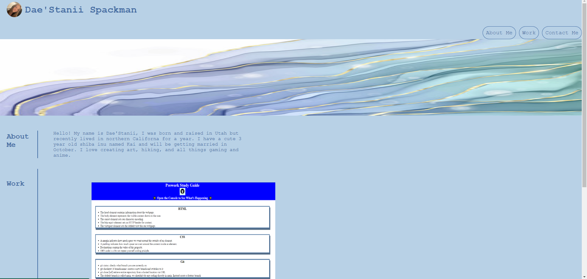

# Challenge-2

Personal Portfolio

## Description

I wanted to create a portfolio with my work and contact information to showcase my evolving coding skills to potential employers. I built this site to ensure my information is easily accessible and organized. I learned to build code from scratch, apply CSS designs to an HTML file, and how to format a page with CSS.

## Usage

'''md

'''

## Link

https://daestanii1997.github.io/Portfolio/